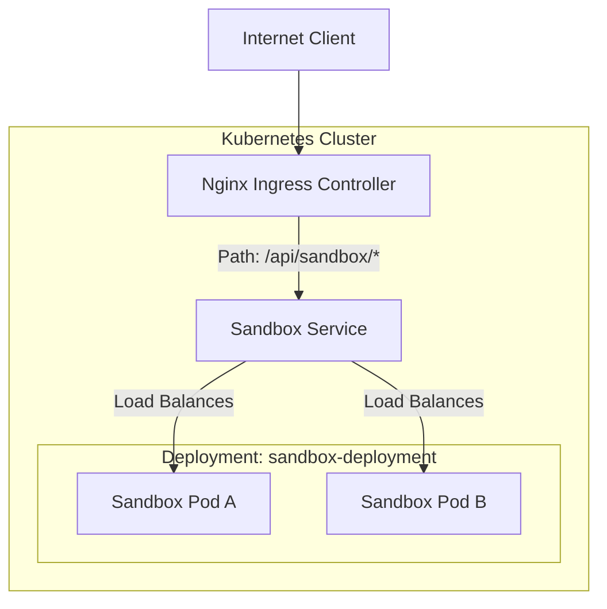
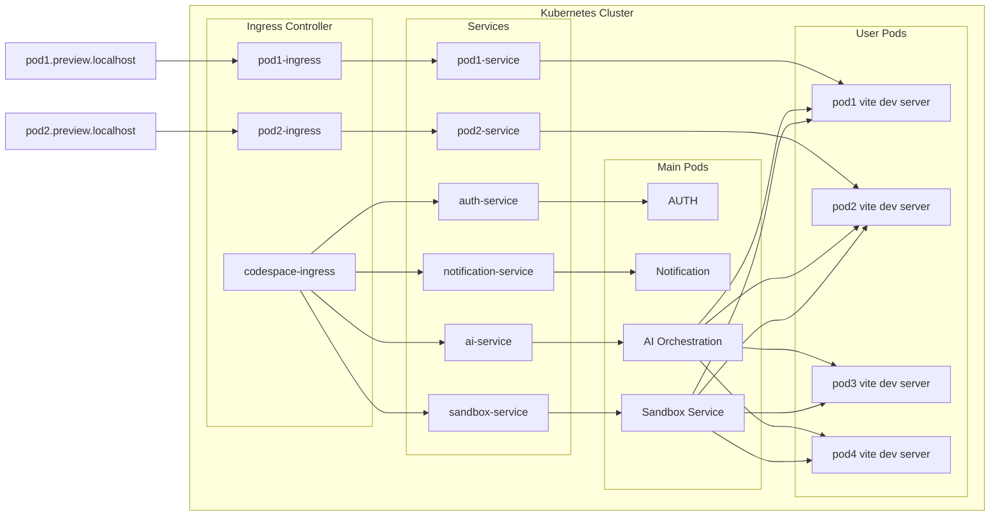

# 🚀 Capstone: The Sandbox Microservice

Welcome to the **Sandbox**, a foundational microservice designed as a playground for mastering modern software engineering, containerization, and cloud-native orchestration. This project isn't just a server; it's a technical journal of the journey from local code to a self-healing, orchestrated deployment.

---

## 📖 Project Overview

The **Sandbox** serves as the entry point and experimental ground for the larger Capstone project. It implements a robust Node.js environment configured for scalability and observability. The primary goal of this service is to establish a standardized pattern for microservices within the ecosystem—handling routing, health monitoring, and container lifecycle management.

### **Core Purpose**
- **Standardization**: Providing a blueprint for future microservices.
- **Observability**: Implementing health check patterns for orchestrator awareness.
- **DevOps Integration**: Bridging the gap between application logic and infrastructure.

---

## 🛠 Tech Stack & Engineering Decisions

### **Backend: Node.js & Express**
- **ES Modules (`import/export`)**: Using modern JavaScript syntax for better tree-shaking and module management.
- **Morgan**: Integrated for request logging, providing visibility into traffic patterns during development and production.
- **Dotenv**: Separation of configuration from code, adhering to [12-Factor App](https://12factor.net/config) principles.

### **Containerization: Docker**
- **Base Image**: `node:20-alpine`.
  - *Why?* Alpine Linux is minimal (~5MB), reducing the attack surface and ensuring fast pull times in CI/CD pipelines.
- **Development Flow**: Uses `nodemon -L` (legacy watch) within the container to support hot-reloading across different file systems (crucial for Windows/WSL/Docker interactions).

### **Orchestration: Kubernetes (K8s)**
- **Self-Healing**: Configured with `livenessProbe` and `readinessProbe` to ensure traffic only hits healthy instances and pods are restarted automatically if they fail.
- **Resource Management**: Explicit `cpu` and `memory` limits/requests to prevent "noisy neighbor" syndrome and ensure cluster stability.
- **Ingress Routing**: Uses Nginx Ingress to manage the `/api/sandbox/` path, abstracting internal service complexity from the client.

---

## 🏗 System Architecture

The following diagram illustrates how a request flows from the outside world into our sandbox environment:



## Kubernetes Sandbox Orchestration Architecture

The platform follows a microservices + Kubernetes-based sandbox orchestration architecture inspired by modern AI coding platforms like Lovable.

### Flow Overview

1. Users access isolated preview environments using dynamic subdomains like:
   - `pod1.preview.localhost`
   - `pod2.preview.localhost`

2. Requests first hit the Kubernetes Ingress Controller which routes traffic to the correct sandbox pod.

3. Each preview environment has:
   - its own ingress
   - dedicated Kubernetes service
   - isolated sandbox pod running a Vite development server

4. The main application cluster contains core backend services:
   - Authentication Service
   - Notification Service
   - AI Orchestration Service
   - Sandbox Management Service

5. The AI Orchestration Service coordinates:
   - AI code generation
   - container lifecycle
   - sandbox provisioning
   - file synchronization
   - execution workflows

6. The Sandbox Service dynamically creates and manages user-specific pods inside the Kubernetes cluster.

7. Every user sandbox runs independently, allowing:
   - isolated execution
   - live preview URLs
   - secure containerized environments
   - scalable multi-user development sessions

8. Services communicate internally through Kubernetes Services for secure pod-to-pod networking.



---

## 📂 Folder Structure Explained

| Directory | Purpose | Key Files |
| :--- | :--- | :--- |
| `sandbox/server/` | The core Node.js application. | `server.js` (Entry), `dockerfile` |
| `sandbox/server/src/` | Modularized source code. | `app.js` (Express logic) |
| `k8s/` | Infrastructure as Code (IaC). | `ingress.yml`, `sandbox-deployment.yml` |

---

## 🧠 Concepts Learned & Deep Dives

### **1. The Container Lifecycle**
In this project, I explored the transition from "it works on my machine" to "it works everywhere."
- **Image Layers**: Each instruction in the `dockerfile` creates a layer. By copying `package.json` before the source code, we leverage Docker's cache to avoid re-installing dependencies unless they change.
- **Environment Parity**: The container ensures the exact same Node version and OS environment are used in development and production.

### **2. Orchestration vs. Hosting**
Moving to Kubernetes introduced the concept of **Desired State**. 
- Instead of manually starting a server, we tell K8s: "I want 1 replica of this image running." 
- If the pod crashes, the **Deployment Controller** detects the discrepancy and spins up a new one.

### **3. Health Check Patterns**
- **Readiness Probe**: "Is the app ready to receive traffic?" (e.g., has it connected to the DB?).
- **Liveness Probe**: "Is the app still alive, or is it deadlocked?"
*Insight*: Misconfiguring these can lead to "crash loops"—if the liveness probe fails because the app is just slow to start, K8s will kill it before it ever gets a chance.

---

## 🚀 Key Commands

### **Development**
```bash
# Start the server locally with hot-reloading
cd sandbox/server
npm install
npm run dev
```

### **Docker**
```bash
# Build the sandbox image
docker build -t sandbox:latest ./sandbox/server

# Run the container locally
docker run -p 3000:3000 sandbox:latest
```

### **Kubernetes**
```bash
# Apply the infrastructure
kubectl apply -f k8s/

# Check status
kubectl get pods
kubectl get ingress
```

---

## 🚧 Challenges & Debugging Journey

- **Windows File Watching**: Initially, `nodemon` wouldn't restart on file changes inside the Docker container. 
  - *Fix*: Switched to `nodemon -L` (polling mode) to overcome file system event limitations in Docker Desktop on Windows.
- **Ingress Path Mapping**: Getting the `pathType: Prefix` right in `ingress.yml` was tricky. It requires the backend service to either handle the prefix or use a rewrite-target annotation (currently handled by service-level path matching).

---

## 🔮 Future Improvements

- [ ] **Database Integration**: Initialize `mongoose` and connect to a MongoDB instance.
- [ ] **Service Mesh**: Explore Istio for better observability between services.
- [ ] **CI/CD Pipeline**: Automate the build and deploy process using GitHub Actions.
- [ ] **Security**: Implement JWT authentication and secure the Ingress with TLS.

---

> **Personal Note**: This sandbox is more than code; it's the foundation of my engineering discipline. Every line of YAML and JS here represents a step toward building resilient, distributed systems.
