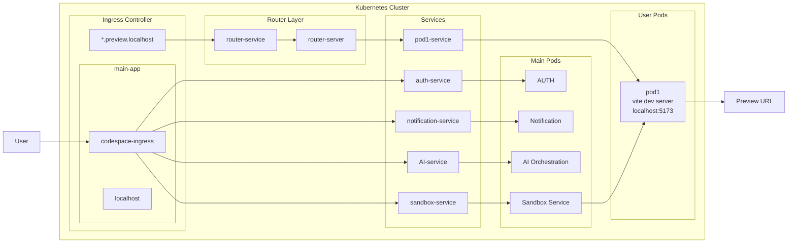
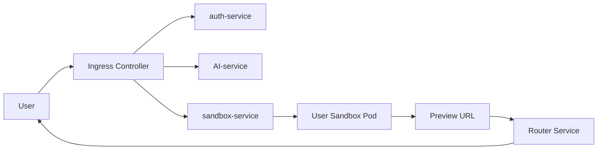

# Capstone: The Sandbox Orchestrator

## Project Overview
This project evolved from a simple Node.js microservice into a sophisticated **Kubernetes Sandbox Orchestrator**. It provides a programmable infrastructure to spin up, manage, and route traffic to isolated development environments (sandboxes). The final architecture mimics modern AI-driven coding platforms, allowing users to access dedicated Vite-based previews via dynamic subdomains.

## How This Project Evolved
The journey began with a single-container microservice designed for basic health monitoring. As the requirements shifted toward multi-tenancy and isolation, the project transitioned from **static infrastructure** (manually applied YAML) to **dynamic orchestration** (code-driven infrastructure). This evolution required building a custom control plane (the Sandbox Server) and a data plane (the Router) to handle the lifecycle and connectivity of user-specific pods.

## Learning Journey

### Project Updated Architecture



### Phase 1 — The Microservice Foundation
- **What was built**: A standard Node.js/Express server containerized with Docker and deployed via static Kubernetes manifests.
- **What limitations existed**: Scaling required manual intervention; all users shared the same environment; no isolation between different "sandbox" requests.
- **What was learned**: Docker layer optimization, the 12-Factor App methodology for configuration (`dotenv`), and the importance of Kubernetes probes (`liveness` vs `readiness`).

### Phase 2 — Programmable Infrastructure
- **What changed**: Integrated the `@kubernetes/client-node` library into the Sandbox Server. Created the `kubernetes/` module to handle programmatic pod and service creation.
- **Why it changed**: To support on-demand environment provisioning. The system needed to move away from "apply once" to "create on request."
- **What concepts were learned**: Kubernetes API interactions, CRD-like patterns for custom resource management, and the necessity of **RBAC (Role-Based Access Control)** to grant the server permissions to manage other cluster resources.

### Phase 3 — Dynamic Routing & Isolation
- **What changed**: Introduced the `router` service and configured wildcard Ingress hosts (`*.preview.localhost`).
- **Why it changed**: Once multiple pods were running, there was no way to route traffic to a specific sandbox based on the URL.
- **What concepts were learned**: Reverse proxying with `http-proxy-middleware`, dynamic host-based routing, and managing WebSocket connections for live-reloading Vite servers within a proxied environment.

### Phase 4 — Security & Resource Governance
- **What changed**: Implemented explicit ServiceAccounts and RoleBindings. Added resource limits and requests to the dynamic pod manifests.
- **Why it changed**: To prevent "noisy neighbor" issues where one sandbox could crash the entire node and to secure the management API.
- **What concepts were learned**: Kubernetes security context, resource quotas, and the "least privilege" principle in infrastructure design.

## Key Technical Concepts Learned
- **Orchestration Control Plane**: Building an API that controls the lifecycle of other containers.
- **Dynamic Proxying**: Implementing a gateway that performs service discovery on-the-fly based on request headers.
- **RBAC Governance**: Designing ServiceAccounts and Roles to securely allow pod-to-pod management.
- **Container Networking**: Understanding how Kubernetes Services bridge the gap between ephemeral pods and stable routing.

## Architecture Decisions
- **Decoupled Gateway (Router)**: Instead of the Sandbox Server handling traffic, a dedicated `router` service was built. This improves scalability and allows the management API to be separate from the data plane.
- **Subdomain-Based Isolation**: Using `pod-id.preview.localhost` provides a clean, production-like URL structure for users, similar to Vercel or Netlify.
- **Template-Based Provisioning**: Every sandbox starts from a standardized `template` image, ensuring environment parity across all user sessions.

## Refactoring Improvements
- **Static to Dynamic**: Replaced manual `kubectl apply` workflows with a `POST /api/sandbox/start` endpoint that handles the entire lifecycle.
- **Consolidated Kubernetes Logic**: Refactored scattered K8s logic into a dedicated `src/kubernetes/` module in the server, separating infrastructure logic from application routes.
- **Logging Evolution**: Moved from basic `console.log` to structured `morgan` logging in the router to debug complex proxying issues.

## Problems Solved During Development
- **The "Missing Service" Race Condition**: Initially, the router would fail if the K8s service wasn't ready. *Solution*: Implemented a more resilient proxying strategy and leveraged K8s readiness probes to ensure the router only sends traffic to healthy pods.
- **RBAC Permissions**: The Sandbox Server couldn't create pods initially due to `Forbidden` errors. *Solution*: Designed a custom `resource-manager` ServiceAccount and Role with scoped permissions to `pods` and `services`.
- **Windows HMR Support**: Vite's Hot Module Replacement (HMR) struggled inside Docker on Windows. *Solution*: Configured `nodemon -L` and ensured the proxy supports WebSocket (`ws: true`) for seamless development.

## Final Project Structure
- **`sandbox/server/`**: The Control Plane. Manages the K8s API and pod lifecycles.
- **`sandbox/router/`**: The Data Plane. Proxies subdomain traffic to the correct internal K8s services.
- **`sandbox/template/`**: The Blueprint. A Vite + React application used as the base for all sandboxes.
- **`k8s/`**: The Infrastructure. Contains the global configuration for Ingress, RBAC, and the core services.

## Tech Stack
- **Runtime**: Node.js (ES Modules)
- **Framework**: Express
- **Orchestration**: Kubernetes (K8s)
- **Containerization**: Docker
- **Proxying**: `http-proxy-middleware`
- **Frontend Template**: Vite + React

## Architecture Evolution Timeline

This project evolved from a basic sandbox execution setup into a more distributed Kubernetes-based development platform.

---

### Phase 1 — Kubernetes Sandbox Environment

#### Commit
```bash
feat: add kubernetes-backed sandbox environment
```

#### What Changed
- Introduced isolated sandbox environments running inside Kubernetes pods
- Added dynamic pod provisioning for user workspaces
- Configured service communication between sandbox containers
- Integrated containerized development runtime

#### What I Learned
- Kubernetes pod lifecycle management
- Service discovery inside clusters
- Container networking
- Resource isolation strategies
- Managing ephemeral development environments

#### Problems Solved
- Prevented users from sharing the same execution environment
- Improved isolation and scalability
- Made sandbox instances reproducible

---

### Phase 2 — Router Layer with Docker + Kubernetes

#### Commit
```bash
feat(router): add router with docker and k8s setup
```

#### What Changed
- Added dedicated router service
- Introduced preview URL routing
- Connected ingress controller with user-specific sandbox pods
- Added Dockerized routing layer
- Implemented internal service forwarding architecture

#### What I Learned
- Kubernetes ingress architecture
- Reverse proxy and request forwarding
- Dynamic routing for multi-user environments
- Service-to-service communication
- Internal networking inside Kubernetes

#### Problems Solved
- Enabled user-specific preview URLs
- Improved request routing scalability
- Separated routing logic from application logic
- Reduced coupling between services

---

### Phase 3 — Microservice-Oriented Platform Architecture

#### Current Architecture
The platform now consists of multiple isolated services:

- Auth Service
- Notification Service
- AI Orchestration Service
- Sandbox Service
- Router Service
- User-specific Runtime Pods

#### Architectural Improvements
- Better separation of concerns
- Independent scaling of services
- Cleaner internal communication boundaries
- Easier debugging and deployment
- More production-oriented infrastructure design

---

## Current System Flow



---

## Key Engineering Lessons

- Designing distributed systems is mostly about managing boundaries
- Kubernetes networking becomes complex very quickly without proper service separation
- Preview environments require both infrastructure orchestration and routing orchestration
- Separating ingress, router, and runtime services improves scalability significantly
- Container isolation alone is not enough without proper traffic management

## What I Would Improve Next
- **Persistence Layer**: Implement Persistent Volume Claims (PVCs) so user code survives pod restarts.
- **Garbage Collection**: Build a "reaper" service to automatically delete inactive pods and free up cluster resources.
- **Authentication**: Secure the Sandbox API and individual preview URLs with JWT-based authentication.
- **Monitoring**: Integrate Prometheus and Grafana to track resource usage across all dynamic sandboxes.
