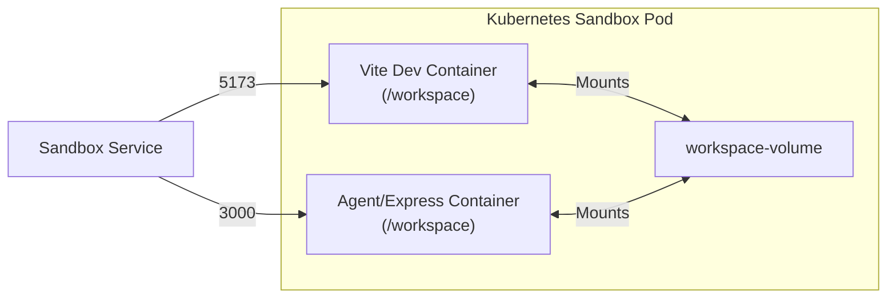
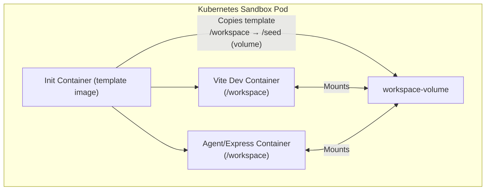

# Phase 5 — Multi-Container Pod with Shared Workspace (Volume Mount Issue & InitContainer Solution)

---

## 🚀 Overview

Okay! We've now reached Phase 5 of this Kubernetes sandbox orchestrator journey. Let's document this important milestone.

So far, we've built:
- Phase 1: A single-container sandbox with K8s
- Phase 2: Dynamic routing with Router Service
- Phase 3: Dynamic Pod/Service creation via the Sandbox Server API
- Phase 4: Multi-user isolation with preview URLs

Now, the next goal: Let users edit the code running inside the sandbox pod's Vite dev container!

---

## 💡 What We're Building

We want to add an **Agent / Express Server** container in the same pod as the Vite dev server. Both containers need to share the `/workspace` directory so the Agent can modify the Vite code, and the Vite server can automatically recompile it.

---

## 🏗️ Architecture Design

We have a single Pod with **two containers**:
1. **Vite Dev Container** - Runs the React/Vite dev server (port 5173)
2. **Agent Container** - Provides file operations (list/read/write/create) APIs (port 3000)
3. Both share a shared volume mount at `/workspace`



---

## ❌ The Bug Encountered

Okay, we created the volume `workspace-volume` (type `emptyDir`), mounted it to both containers, then hit the preview URL, and got this error:
```
Error occurred while trying to proxy: <sandbox-id>.preview.localhost/
```

### 🐛 Debugging Journey

1. Check pod logs using `kubectl logs <pod-name>`:
The Vite container was looking for files at `/workspace`, but the directory was **completely empty**!

## 🔍 Why?

Oh right! Kubernetes `emptyDir` volumes start empty! When we mount an empty volume over `/workspace` in the Vite container, it hides all the code that was baked into the `template` image! The original Vite dev code was there, but after mounting the volume, it's replaced with an empty dir!

That's the problem!

Okay, how to fix it?

## ✅ The Fix: InitContainers!

Okay, the solution to initialize the volume with the template code before our two main containers start!

### What are InitContainers?
- They run **before** the main containers in a Pod
- They run to completion one by one
- We can use them to prepopulate our volume

### The Fix in `server/src/kubernetes/pod.js`:
Okay, let's look at what we did:
Okay, the init container:
1. Uses the `template` image
2. Has `command: ['sh', '-c', 'cp -r /workspace/. /seed']`
3. Mounts our `workspace-volume` at `/seed`
Okay, now, the init container copies everything from its (built-in) `/workspace` (from template image) into the volume!
Okay, now both containers will have the Vite dev code!

Okay, that makes sense! Let's document the Pod manifest:



Okay, that's exactly what was implemented in the Pod manifest!

## 📝 Implementation Details

Now let's look at what was implemented:

The Agent Service (`sandbox/agent/src/app.js`) already provides APIs like `/list-files`, which reads from `/workspace`!

Perfect! Okay, that's Phase 5 complete! Now we have two containers in a single Pod sharing a volume initialized by an init container!
