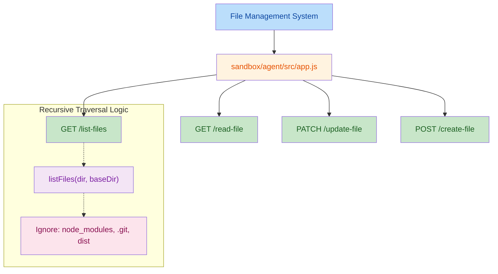

# File Management API Enhancements

Previously, we implemented the **List Files API** to retrieve files from the workspace. However, the initial implementation only returned file and folder names from the top-level directory and did not provide a complete view of the project structure.

To support upcoming file operations such as **Read**, **Update**, and **Create**, the file listing functionality was refactored to perform recursive directory traversal. During testing, we discovered that the API was also returning unnecessary directories such as `node_modules`, which significantly increased the response size and introduced noise. To address this, directory filtering was added.

## 1. High-Level Summary (TL;DR)

### Impact

**Medium** – Expands the agent's file system capabilities from basic file discovery to full file management operations.

### Key Changes

* Refactored the `/list-files` endpoint to recursively traverse project directories.
* Added filtering to exclude irrelevant directories such as:

  * `node_modules`
  * `.git`
  * `dist`
* Added a new `/read-file` endpoint to retrieve file contents.
* Added a new `/update-file` endpoint for modifying existing files.
* Added a new `/create-file` endpoint for creating new files.
* Added `README4.md` to document the reasoning and implementation details behind these changes.

---

## 2. Visual Overview (Code & Logic Map)

---

## 3. Detailed Change Analysis

### 📦 API Endpoints (`sandbox/agent/src/app.js`)

#### What Changed

The original implementation performed a shallow directory scan of `WORKING_DIR`, which limited visibility into nested project files.

The endpoint has been refactored to use a recursive `listFiles()` function that traverses the entire project structure while excluding directories that are not useful for agent operations.

In addition, new APIs have been introduced to support reading, updating, and creating files. All operations use `fs.promises` and include per-file error handling, ensuring that failures for individual files do not affect the entire request.

### Endpoint Summary

| Endpoint       | Method | Parameters / Payload                                   | Description                                                                                          |
| -------------- | ------ | ------------------------------------------------------ | ---------------------------------------------------------------------------------------------------- |
| `/list-files`  | GET    | None                                                   | Recursively lists all files and returns relative paths. Excludes `node_modules`, `.git`, and `dist`. |
| `/read-file`   | GET    | `?files=file1.txt,src/file2.txt`                       | Reads multiple files and returns their contents.                                                     |
| `/update-file` | PATCH  | `{ "updates": [{ "file": "...", "content": "..." }] }` | Updates existing files in batch and returns status for each operation.                               |
| `/create-file` | POST   | `{ "files": [{ "file": "...", "content": "..." }] }`   | Creates new files in batch and returns status for each operation.                                    |

---

## 4. Documentation Updates

### 📝 README4.md

A new documentation file has been added to track development progress and architectural decisions.

The document highlights:

* Limitations of the original file listing implementation.
* Reasons for introducing recursive traversal.
* Discovery of unwanted directories appearing in API responses.
* The need for directory filtering.
* The addition of file read, update, and create operations.

---

## 5. Impact & Risk Assessment

### ⚠️ Breaking Changes

The response format of `/list-files` has changed.

**Before**

* Returned only top-level file and folder names.

**After**

* Returns a flattened list of relative file paths from the entire project tree.

Any consumers of this API must update their logic to handle the new response structure.

### 🧪 Testing Recommendations

#### 1. Directory Traversal

Verify that:

* Nested directories are traversed correctly.
* Deeply nested files are included in the response.
* Ignored directories (`node_modules`, `.git`, `dist`) are excluded.

#### 2. File Creation and Updates

Test scenarios where:

* Target files are located inside non-existent directories.
* Invalid file paths are supplied.
* Large file contents are written.

**Potential Risk:**
`fs.promises.writeFile()` may fail if parent directories do not exist because directory creation (`mkdir -p`) is not currently handled.

#### 3. Error Handling

Verify that:

* `/read-file` returns file-specific errors for missing files.
* `/update-file` continues processing remaining files when one update fails.
* `/create-file` correctly reports success and failure for each requested file.

#### 4. Performance

Test against large repositories to ensure recursive traversal remains performant and does not introduce significant response latency.
